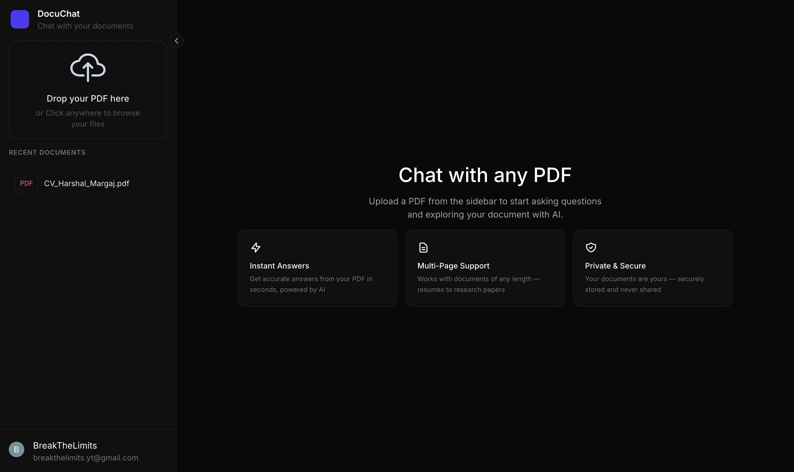
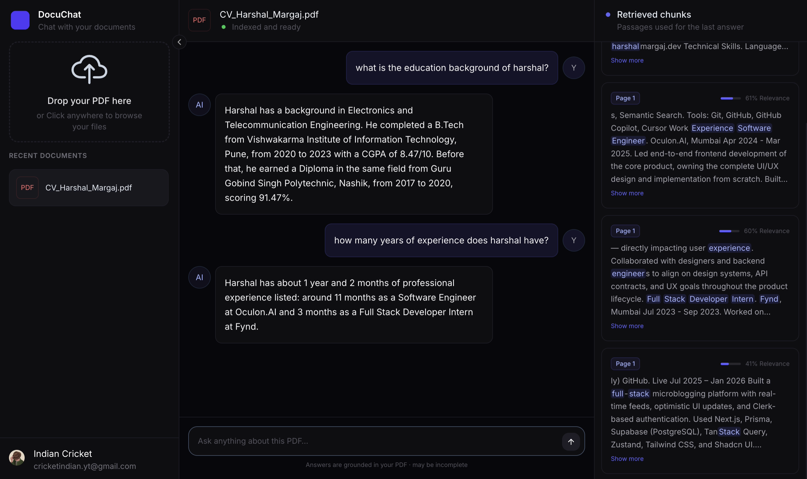
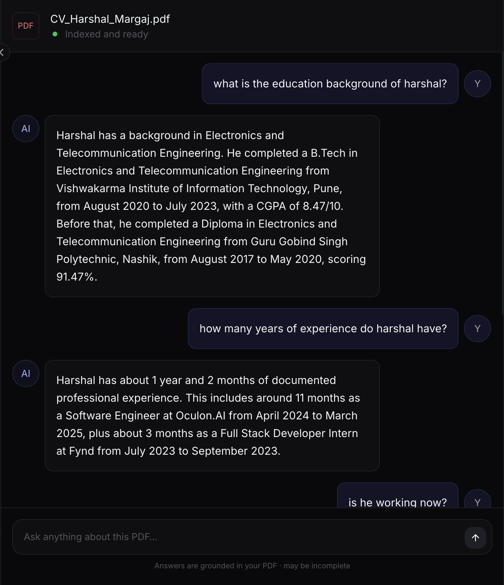
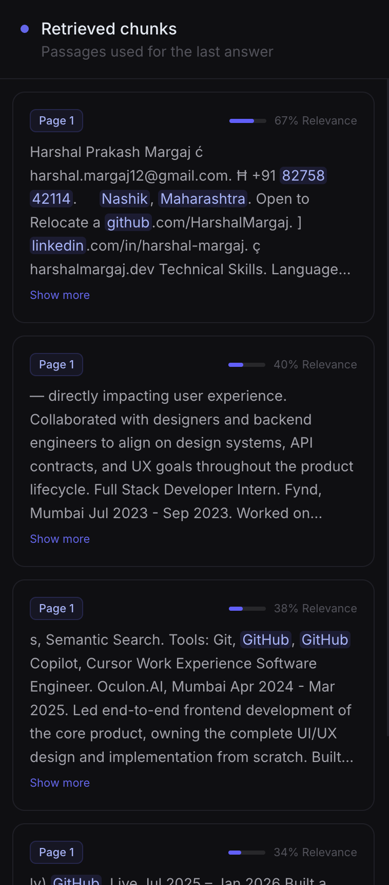
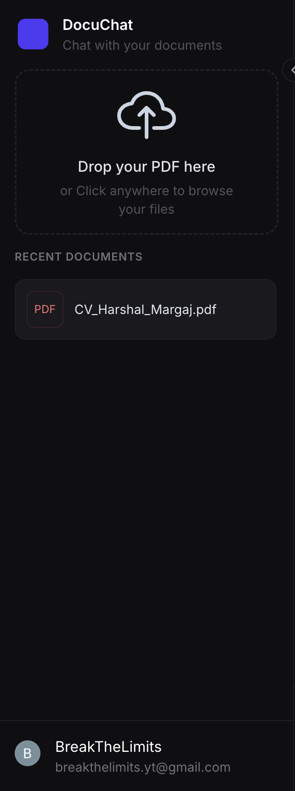

# 📄 DocuChat

### Chat with any PDF using AI-powered semantic search

Upload a document, ask questions in plain English, and get accurate answers grounded in your PDF — powered by Retrieval-Augmented Generation (RAG).

[](https://nextjs.org/)
[](https://www.typescriptlang.org/)
[](https://sdk.vercel.ai/)
[](https://clerk.com/)
[](https://www.postgresql.org/)

[Live Demo](https://docuchat-silk.vercel.app/) · [Demo Video](https://drive.google.com/file/d/1OLsC_xoDz-PI0sJd30VyV4MDY7EZfOxd/view?usp=sharing)

---

## 📌 About The Project

**DocuChat** is a full-stack RAG (Retrieval-Augmented Generation) application that lets users upload PDF documents and have natural, context-aware conversations with them. Instead of manually searching through pages of text, users can ask questions and get precise, source-grounded answers — with full transparency into which parts of the document were used to generate each response.

This project was built to demonstrate a production-shaped implementation of RAG: document chunking, vector embeddings, semantic search, streaming AI responses, and secure multi-tenant data handling.

> ⚠️ **Note on the live demo:** To manage API costs, live PDF uploads and chat are disabled on the deployed version. Please watch the [demo video](#) below to see the full flow in action, or follow the [setup instructions](#-getting-started) to run it locally with your own API keys.

---

## ✨ Features

- 🔐 **Secure Authentication** — Full user auth via Clerk, with per-user document isolation
- 📤 **Drag & Drop Upload** — Simple, intuitive PDF upload with real-time processing feedback
- 🧠 **Semantic Search** — Documents are chunked and embedded for accurate, context-aware retrieval
- 💬 **Streaming Chat** — Real-time, token-by-token AI responses using the Vercel AI SDK
- 🔍 **Source Transparency** — See exactly which passages from the PDF were used to generate each answer
- 📚 **Chat History** — Conversations are persisted per document and reloaded on return visits
- 🗂️ **Recent Documents** — Quickly switch between previously uploaded PDFs
- 📱 **Responsive, Collapsible Sidebar** — Clean, modern UI with a smooth collapse/expand interaction
- 🌓 **Polished Dark UI** — Custom-designed interface built with Tailwind CSS

---

## 🛠️ Tech Stack

| Category             | Technology                               |
| -------------------- | ---------------------------------------- |
| **Framework**        | Next.js 15 (App Router)                  |
| **Language**         | TypeScript                               |
| **Styling**          | Tailwind CSS                             |
| **Authentication**   | Clerk                                    |
| **Database**         | PostgreSQL (Supabase)                    |
| **ORM**              | Prisma                                   |
| **Vector Search**    | pgvector                                 |
| **AI / LLM**         | Vercel AI SDK, OpenAI                    |
| **File Handling**    | PDF parsing & chunking (custom pipeline) |
| **Deployment**       | Vercel                                   |
| **State Management** | Zustand                                  |

---

## 🎥 Demo

**Watch the full walkthrough:** login → upload → chat → source retrieval

[](https://drive.google.com/file/d/1OLsC_xoDz-PI0sJd30VyV4MDY7EZfOxd/view?usp=sharing)

---

## 📸 Preview

### Landing Page





### Chat Interface



### Source Retrieval Panel



### Sidebar



---

## 🏗️ How It Works

1. **Upload** — User uploads a PDF, which is parsed and split into semantic chunks
2. **Embed** — Each chunk is converted into a vector embedding and stored in PostgreSQL (via `pgvector`)
3. **Query** — When a user asks a question, it's embedded and compared against stored chunks using cosine similarity
4. **Retrieve** — The most relevant chunks are retrieved and passed to the LLM as context
5. **Generate** — The AI streams back an answer grounded in the retrieved passages, with sources shown alongside

---

## 🚀 Getting Started

Since live uploads are disabled on the deployed demo, follow these steps to run the full app locally with your own API keys.

### Prerequisites

- Node.js 18+
- A PostgreSQL database with the `pgvector` extension (e.g. [Supabase](https://supabase.com/))
- A [Clerk](https://clerk.com/) account
- An [OpenAI](https://platform.openai.com/) (or equivalent) API key

### Installation

```bash
# Clone the repo
git clone https://github.com/your-username/docuchat.git
cd docuchat

# Install dependencies
npm install

# Set up environment variables
cp .env.example .env
```

### Environment Variables

Create a `.env` file with the following:

```env
DATABASE_URL=

NEXT_PUBLIC_CLERK_PUBLISHABLE_KEY=
CLERK_SECRET_KEY=
CLERK_WEBHOOK_SIGNING_SECRET=

OPENAI_API_KEY=

NEXT_PUBLIC_CLERK_SIGN_IN_URL=/sign-in
NEXT_PUBLIC_CLERK_SIGN_UP_URL=/sign-up
NEXT_PUBLIC_CLERK_SIGN_IN_FALLBACK_REDIRECT_URL=/
NEXT_PUBLIC_CLERK_SIGN_UP_FALLBACK_REDIRECT_URL=/
```

### Database Setup

```bash
npx prisma migrate dev
```

### Run the Dev Server

```bash
npm run dev
```

Open [http://localhost:3000](http://localhost:3000) to view the app.

---

## 📂 Project Structure

```
rag-pdf-chatbot/
├── actions/                          # Server actions
├── app/
│   ├── (clerk)/
│   │   ├── sign-in/[[...sign-in]]/
│   │   ├── sign-up/[[...sign-up]]/
│   │   └── layout.tsx
│   ├── (main)/
│   │   ├── chat/[id]/
│   │   ├── layout.tsx
│   │   └── page.tsx               # Homepage
│   ├── api/
│   │   ├── chat/                  # Streaming chat endpoint
│   │   ├── upload/                # PDF upload + processing
│   │   └── webhooks/clerk/        # User sync webhook
│   ├── generated/prisma/
│   ├── favicon.ico
│   ├── globals.css
│   └── layout.tsx
├── components/
│   ├── chat/
│   │   ├── ChatEmptyState.tsx
│   │   ├── ChatHeader.tsx
│   │   ├── ChatInput.tsx
│   │   ├── ChatMain.tsx
│   │   └── ChatScreen.tsx
│   ├── Sidebar/
│   │   ├── Sidebar.tsx
│   │   ├── SidebarLogo.tsx
│   │   ├── SidebarRecentDocuments.tsx
│   │   ├── SidebarUploadZone.tsx
│   │   └── SidebarUserFooter.tsx
│   ├── sourcePanel/
│   │   ├── SourceCard.tsx
│   │   └── SourcesPanel.tsx
│   ├── GlobalUploadLoader.tsx
│   └── Loader.tsx
├── lib/
│   ├── ai/
│   ├── db.ts
│   ├── PlaySound.ts
│   ├── SanitizeText.ts
│   └── SplitIntoChunks.ts
├── prisma/
│   ├── migrations/
│   └── schema.prisma
├── public/
└── .env
```

---

## 🗺️ Roadmap

- [ ] Support for additional file types (DOCX, TXT)
- [ ] Multi-document chat (query across multiple PDFs at once)
- [ ] Export chat history as PDF/Markdown
- [ ] Usage analytics dashboard

---

## 🤝 Contributing

Contributions, issues, and feature requests are welcome. Feel free to check the [issues page](https://github.com/HarshalMargaj/rag-pdf-chatbot/issues).

---

## 📬 Contact

**Harshal Margaj**

- LinkedIn: [www.linkedin.com/in/harshal-margaj](https://www.linkedin.com/in/harshal-margaj/)
- Email: harshal.margaj12@gmail.com

---

If you found this project helpful, consider giving it a ⭐️
